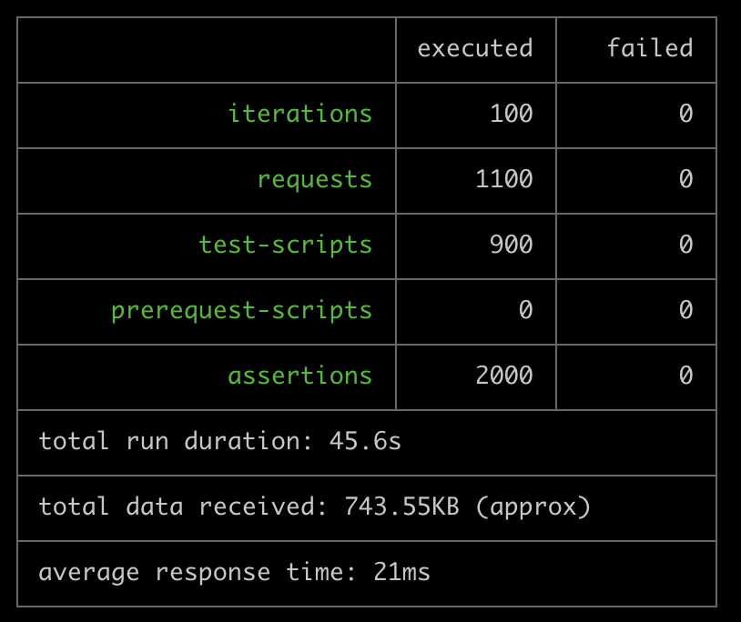
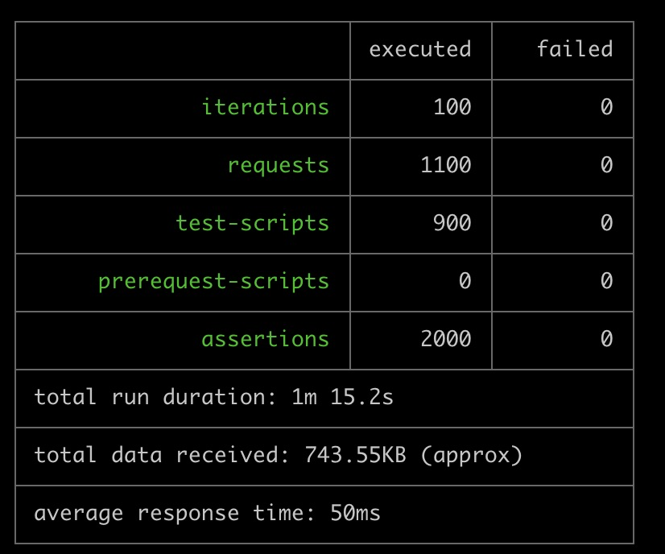

# PyPy 3

## 性能对比

除了编译的容器方法不一样，其他环境配置一致，同样执行如下命令：

```
newman run -n 100 authn.postman_collection.json -e local.postman_environment.json
```

`python:3.7` 执行结果如下：


`pypy:3-slim` 执行结果如下：


没错，这里 pypy3 比 python3.7 慢！
