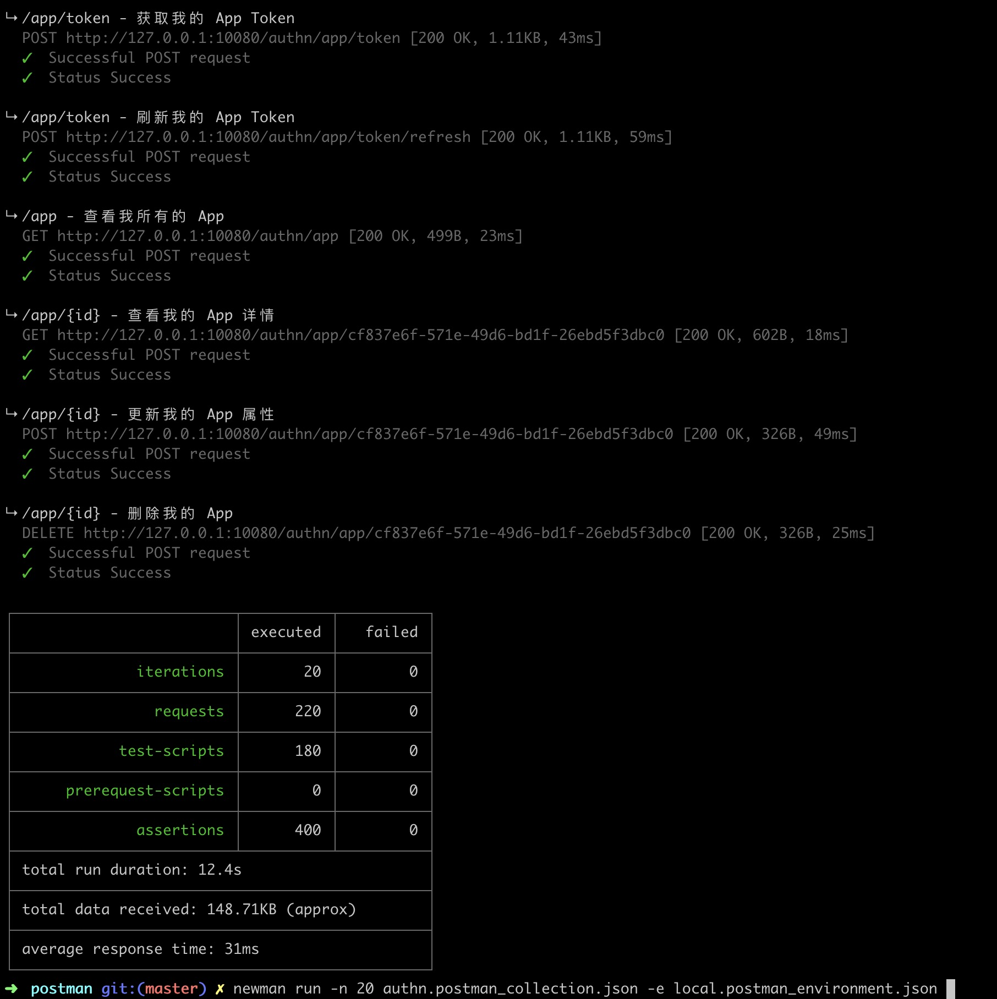

# Postman 测试

## 命令行

使用 newman 运行 collections

- [Newman - Running collections in the command line](https://www.getpostman.com/docs/v6/api_testing_and_collection_runner/newman_intro)

示例：

```
newman run -n 20 authn.postman_collection.json -e local.postman_environment.json
```


